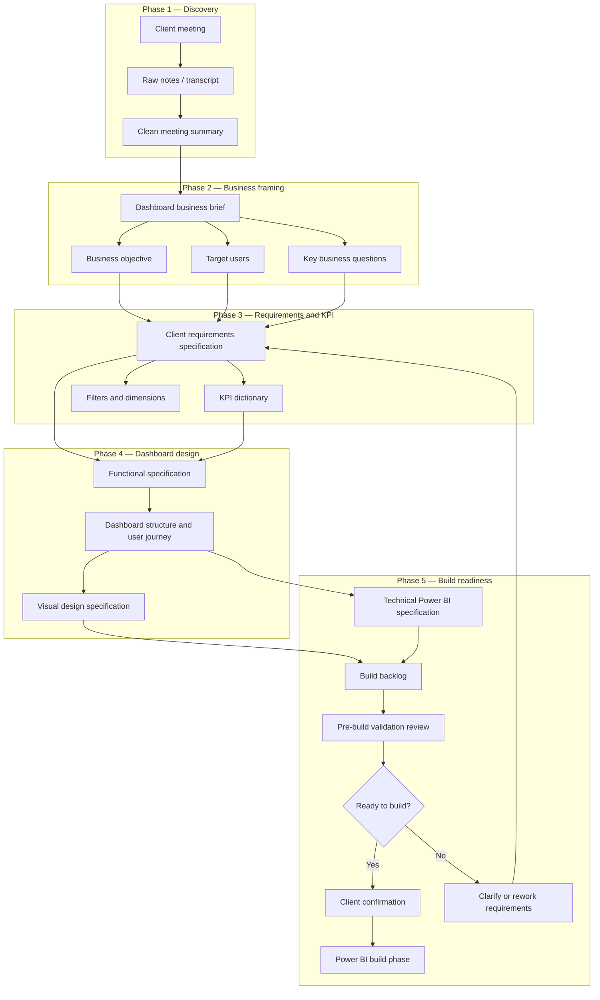

## Spec-Driven Workflow for Power BI Dashboard Creation

```mermaid
flowchart TD

    subgraph P1[Phase 1 — Discovery]
        A[Client meeting] --> B[Raw notes / transcript]
        B --> C[Clean meeting summary]
    end

    subgraph P2[Phase 2 — Business framing]
        C --> D[Dashboard business brief]
        D --> E[Business objective]
        D --> F[Target users]
        D --> G[Key business questions]
    end

    subgraph P3[Phase 3 — Requirements and KPI]
        E --> H[Client requirements specification]
        F --> H
        G --> H
        H --> I[KPI dictionary]
        H --> J[Filters and dimensions]
    end

    subgraph P4[Phase 4 — Dashboard design]
        H --> K[Functional specification]
        I --> K
        K --> L[Dashboard structure and user journey]
        L --> M[Visual design specification]
    end

    subgraph P5[Phase 5 — Build readiness]
        L --> N[Technical Power BI specification]
        M --> O[Build backlog]
        N --> O
        O --> P[Pre-build validation review]
        P --> Q{Ready to build?}
        Q -->|Yes| R[Client confirmation]
        Q -->|No| S[Clarify or rework requirements]
        S --> H
        R --> T[Power BI build phase]
    end
```
