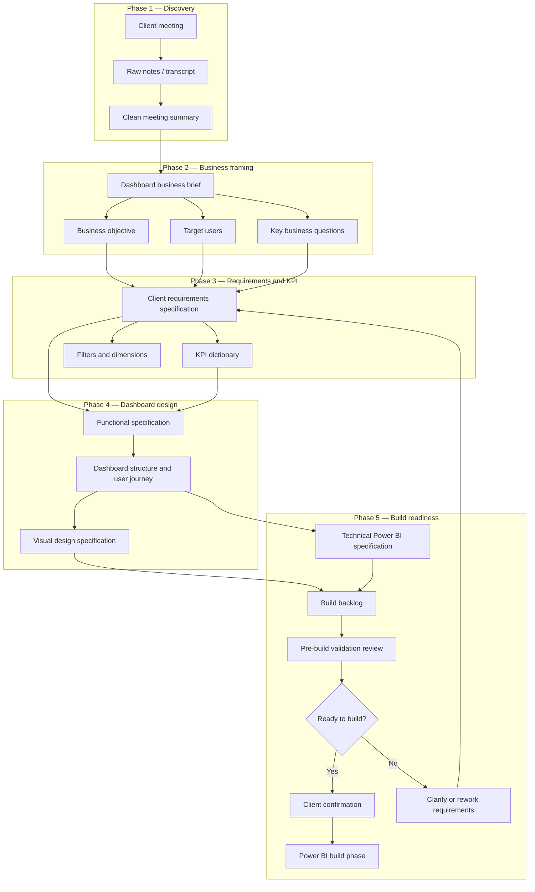

##  Spec-Driven Workflow for Power BI Dashboard Creation (EN version)

## Project Overview

This project presents a **spec-driven workflow for creating a Power BI dashboard from scratch**, starting from the initial client discovery meeting and ending with a build-ready specification package.

The workflow is designed to transform an unstructured client conversation into clear, validated, and reusable BI project artifacts. It focuses on the early stages of dashboard delivery: understanding the business need, defining the dashboard objective, documenting requirements, clarifying KPIs, designing the report structure, and validating readiness before the Power BI build phase begins.

The goal of this project is to reduce ambiguity, prevent unnecessary rework, improve communication with stakeholders, and ensure that the final dashboard supports real business decisions rather than simply displaying disconnected visuals.

## Workflow Phases

| Phase | Folder | Description |
|---|---|---|
| **Phase 1 — Discovery** | [`01_discovery`](./01_discovery/) | Captures the initial client request through a meeting, transcript, or working notes and converts raw input into a structured meeting summary. |
| **Phase 2 — Business Framing** | [`02_business_framing`](./02_business_framing/) | Clarifies the business context, dashboard objective, target users, decision-making needs, and key business questions. |
| **Phase 3 — Requirements & KPI** | [`03_requirements_and_kpi`](./03_requirements_and_kpi/) | Formalizes client requirements, required dashboard pages, KPIs, filters, dimensions, business rules, and validation expectations. |
| **Phase 4 — Dashboard Design** | [`04_dashboard_design`](./04_dashboard_design/) | Defines the dashboard structure, user journey, functional behavior, page logic, visuals, interactions, and visual design principles. |
| **Phase 5 — Build Readiness** | [`05_build_readiness`](./05_build_readiness/) | Prepares the project for Power BI implementation through a technical specification, build backlog, pre-build validation, and client confirmation. |

## Repository Structure

```text
01_Spec_Driven_Workflow_for_Power_BI_Dashboard/
│
├── 01_discovery/
│   ├── README.md
│   ├── discovery_meeting_checklist.md
│   ├── raw_notes_template.md
│   └── clean_meeting_summary_template.md
│
├── 02_business_framing/
│   ├── README.md
│   └── dashboard_business_brief_template.md
│
├── 03_requirements_and_kpi/
│   ├── README.md
│   ├── client_requirements_specification_template.md
│   └── kpi_dictionary_template.md
│
├── 04_dashboard_design/
│   ├── README.md
│   ├── functional_specification_template.md
│   ├── dashboard_structure_template.md
│   └── visual_design_specification_template.md
│
├── 05_build_readiness/
│   ├── README.md
│   ├── technical_powerbi_specification_template.md
│   ├── build_backlog_template.md
│   ├── pre_build_validation_checklist.md
│   └── client_confirmation_message_template.md
│
└── README.md
```

## How to Use This Workflow

1. Start with the **Discovery** phase to collect and structure the initial client request.
2. Move to **Business Framing** to clarify the business objective and decision-making context.
3. Use the **Requirements & KPI** phase to document what the dashboard must contain and how KPIs should be defined.
4. Continue with **Dashboard Design** to define the report structure, user journey, visuals, and design rules.
5. Complete the **Build Readiness** phase to validate whether the project is ready for Power BI implementation.

Each phase contains reusable Markdown templates that can be adapted to real BI projects, client workshops, internal reporting initiatives, or portfolio case studies.

## Workflow Diagram


