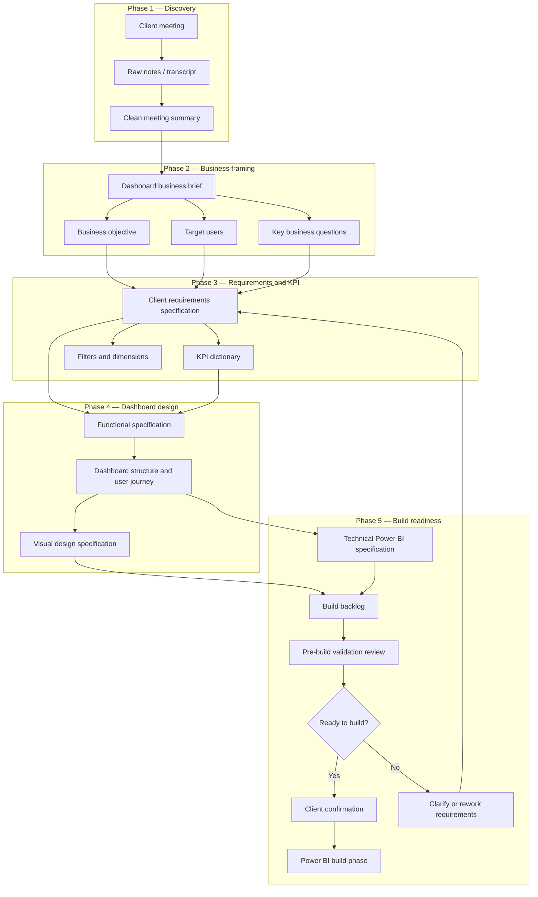

##  Spec-Driven Workflow for Power BI Dashboard Creation (EN version)


## Project Overview

> [!NOTE]
> This project presents a **Generative AI-assisted, spec-driven workflow** for creating a Power BI dashboard from scratch — from the first client discovery meeting to a structured, build-ready specification package.

The workflow starts from unstructured business input, such as meeting notes, transcripts, stakeholder comments, or informal dashboard requests. It progressively transforms this material into a complete documentation package that can guide Power BI dashboard design and implementation.

The main purpose of this project is to demonstrate how **Generative AI can support and accelerate the early stages of BI dashboard delivery** while preserving business alignment, traceability, and human validation.

Generative AI is used as an assistant to help the analyst:

- structure raw meeting notes and transcripts;
- extract business context and decision-making needs;
- draft client requirements specifications;
- identify assumptions, risks, and open questions;
- support KPI documentation and validation;
- draft functional and visual design specifications;
- prepare technical Power BI documentation;
- generate a build backlog;
- support pre-build validation and client confirmation.

> [!IMPORTANT]
> This workflow does not replace the BI analyst or Power BI developer. The analyst remains responsible for reviewing, correcting, validating, and approving all AI-generated outputs.

The goal of this project is to reduce ambiguity, prevent unnecessary rework, improve stakeholder communication, and show how Generative AI can be integrated into a structured analytics engineering workflow.

---

## Business Workflow Phases

| Phase | Folder | Main purpose | Generative AI value | Analytics Engineer role |
|---|---|---|---|---|
| **Phase 1 - Discovery** | [`01_discovery`](./01_discovery/) | Captures the initial client request, prepares the discovery meeting, stores raw notes or transcripts, and converts unstructured stakeholder input into a clean meeting summary. | Helps structure messy meeting material, extract key points, identify missing information, and separate confirmed facts from assumptions. | Guides the discovery process, validates the meeting summary, checks business meaning, and ensures that the initial request is correctly understood before moving forward. |
| **Phase 2 - Business Framing** | [`02_business_framing`](./02_business_framing/) | Converts the discovery summary into a business brief that clarifies the dashboard purpose, target users, supported decisions, scope, expected value, risks, and open questions. | Helps transform raw discovery output into a clear business-oriented brief and highlights unclear objectives, weak scope definition, or missing decision-making context. | Confirms the business objective, challenges unclear needs, validates the scope, and ensures that the dashboard is framed as a decision-support tool rather than a collection of visuals. |
| **Phase 3 - Requirements & KPI** | [`03_requirements_and_kpi`](./03_requirements_and_kpi/) | Formalizes client requirements and structures the KPI dictionary, including business questions, functional needs, filters, dimensions, metric definitions, owners, and validation issues. | Helps draft structured requirements, extract KPIs and metrics, identify missing definitions, distinguish KPIs from dimensions, and surface unresolved data or ownership questions. | Reviews requirements, validates KPI logic with business owners, checks that formulas are not invented, and ensures that requirements are specific enough for dashboard design. |
| **Phase 4 - Dashboard Design** | [`04_dashboard_design`](./04_dashboard_design/) | Defines the dashboard structure, user journey, page logic, visual components, charts, tables, matrices, filters, interactions, navigation, and visual design principles. | Helps convert requirements into a structured dashboard concept, propose suitable visual families, organize analytical flow, and document design assumptions or open questions. | Validates that each page and visual supports a real business question, checks usability and readability, and ensures that the design is feasible and aligned with Power BI implementation constraints. |
| **Phase 5 - Build Readiness** | [`05_build_readiness`](./05_build_readiness/) | Prepares the project for Power BI implementation through a build readiness package, technical preparation, model and KPI implementation checks, backlog creation, validation review, and client confirmation. | Helps translate the validated design into a developer-oriented build package, structure implementation tasks, identify blockers, and draft a clear stakeholder confirmation message. | Assesses technical feasibility, reviews data/model readiness, validates DAX and semantic model needs, prioritizes build tasks, confirms blockers, and approves whether the project is ready to enter the Power BI build phase. |

The final output is a **validated, traceable, build-ready Power BI specification package** that can be used to start the actual Power BI development phase with reduced ambiguity and stronger business alignment.

---

## Generative AI Role Across the Workflow

Generative AI is used as a workflow accelerator, not as an autonomous decision-maker.  
It helps structure information, draft documentation, identify gaps, and prepare reusable project artifacts.  
The Analytics Engineer remains responsible for validation, business alignment, technical feasibility, and final approval.

| Workflow area | GenAI contribution | Analytics Engineer responsibility |
|---|---|---|
| Discovery | Structures meeting notes, transcripts, and stakeholder input into a clean summary. | Validate that the summary reflects the real client conversation and does not turn assumptions into facts. |
| Business framing | Converts discovery output into a business-oriented dashboard brief. | Confirm the business objective, target users, supported decisions, scope, and expected value. |
| Requirements | Drafts structured client requirements from the validated business brief. | Check that requirements are specific, realistic, and supported by confirmed business needs. |
| KPI definition | Extracts and structures KPIs, metrics, owners, definition status, and validation needs. | Confirm KPI definitions with business owners and mark missing formulas, owners, or data logic as `To be confirmed`. |
| Dashboard design | Supports the creation of dashboard structure, user journey, visual components, charts, tables, matrices, and UX rules. | Ensure that each page and visual supports a real business question and remains feasible for Power BI implementation. |
| Build readiness | Helps prepare the build readiness package, implementation backlog, validation checks, blockers, and client confirmation message. | Assess technical feasibility, validate data/model readiness, approve the Go / Conditional Go / No-Go decision, and confirm readiness before development starts. |

---

## Business Workflow Diagram



---

## Repository Structure

The repository is organized as a five-phase workflow that follows the lifecycle of a Power BI dashboard project — from the initial client discovery to build readiness.

Each phase contains a dedicated `README.md`, reusable **Generative AI prompt files**, and structured **artifact templates**. Prompt files are used to guide AI-assisted drafting, structuring, review, or transformation tasks. Artifact templates are the documents produced, completed, and validated by the Analytics Engineer before moving to the next phase.

The structure keeps the workflow modular, traceable, and easy to reuse across different BI dashboard projects.

```text
01_Spec_Driven_Workflow_for_Power_BI_Dashboard/
│
├── 01_discovery/
│   ├── README.md
│   ├── 01_discovery_meeting_checklist.md
│   ├── 02_gen_ai_prompt_customize_checklist.md
│   ├── 03_raw_notes_template.md
│   ├── 04_gen_ai_prompt_convert_raw_into_clean.md
│   └── 05_clean_meeting_summary_template.md
│
├── 02_business_framing/
│   ├── README.md
│   ├── 01_gen_ai_prompt_create_business_brief.md
│   ├── 02_dashboard_business_brief_template.md
│   └── 03_gen_ai_prompt_review_business_brief.md
│
├── 03_requirements_and_kpi/
│   ├── README.md
│   ├── 01_gen_ai_prompt_create_client_requirements_specification.md
│   ├── 02_client_requirements_specification_template.md
│   ├── 03_gen_ai_prompt_create_kpi_dictionary.md
│   └── 04_kpi_dictionary_template.md
│
├── 04_dashboard_design/
│   ├── README.md
│   ├── 01_gen_ai_prompt_create_dashboard_design_specification.md
│   ├── 02_dashboard_design_specification_template.md
│   ├── 03_gen_ai_prompt_create_visual_design_specification.md
│   └── 04_visual_design_specification_template.md
│
├── 05_build_readiness/
│   ├── README.md
│   ├── 01_gen_ai_prompt_create_build_readiness_package.md
│   ├── 02_build_readiness_package_template.md
│   ├── 03_gen_ai_prompt_create_client_confirmation_message.md
│   └── 04_client_confirmation_message_template.md
│
└── README.md
```

---

## How to Use This Workflow

1. Start with [`01_discovery`](./01_discovery/) to prepare the client meeting, capture raw input, and generate a clean meeting summary.
2. Move to [`02_business_framing`](./02_business_framing/) to clarify the business objective, target users, supported decisions, and dashboard value.
3. Use [`03_requirements_and_kpi`](./03_requirements_and_kpi/) to formalize client requirements and structure the KPI dictionary.
4. Continue with [`04_dashboard_design`](./04_dashboard_design/) to define the dashboard structure, user journey, visuals, interactions, and design rules.
5. Complete [`05_build_readiness`](./05_build_readiness/) to validate whether the project is ready for Power BI implementation.
6. Review every AI-generated artifact manually before using it as a project deliverable.

Each phase contains reusable Markdown templates and Generative AI prompts that can be adapted to real BI projects, client workshops, internal reporting initiatives, or portfolio case studies.

---

## Human-in-the-Loop Principle

This project follows a **human-in-the-loop approach**.

Generative AI is used to accelerate drafting, structuring, summarizing, and documentation tasks. However, all outputs must be reviewed by a human analyst before being shared with stakeholders or used for implementation.

The BI analyst remains responsible for:

- validating business meaning;
- checking KPI definitions;
- identifying missing or ambiguous requirements;
- confirming assumptions with stakeholders;
- ensuring that the dashboard supports real business decisions;
- approving the final specification package before the build phase.

> [!CAUTION]
> AI-generated content must never be treated as automatically validated. Any assumption, KPI definition, data source, or business rule that is not explicitly confirmed must be marked as `To be confirmed`.

---

## Final Deliverable

The final output of this workflow is a **build-ready Power BI specification package** that includes:

- a validated discovery summary;
- a dashboard business brief;
- a client requirements specification;
- a KPI dictionary;
- dashboard design documentation;
- technical Power BI preparation;
- a build backlog;
- pre-build validation and client confirmation.
