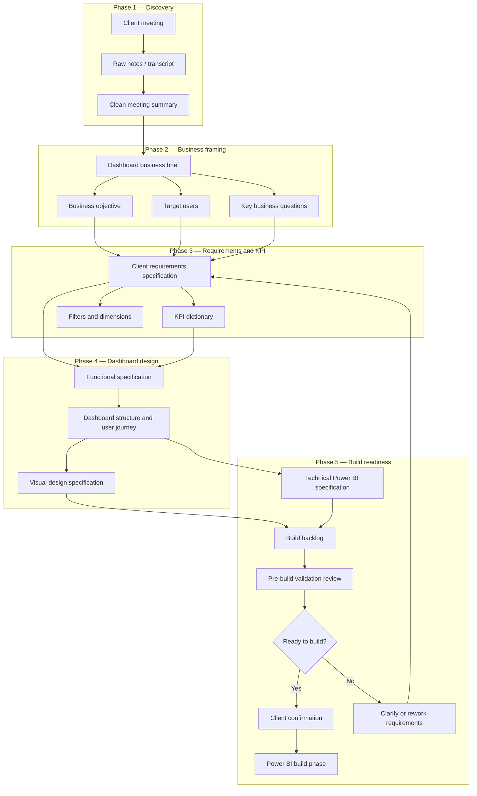

##  Spec-Driven Workflow for Power BI Dashboard Creation (EN version)


## Project Overview

> [!NOTE]
> This project presents a **Generative AI-assisted, spec-driven workflow** for creating a Power BI dashboard from scratch — from the first client discovery meeting to a structured, build-ready specification package.

The workflow starts from unstructured business input, such as meeting notes, transcripts, stakeholder comments, or informal dashboard requests. It progressively transforms this material into a complete documentation package that can guide Power BI dashboard design and implementation.

The main purpose of this project is to demonstrate how **Generative AI can support and accelerate the early stages of BI dashboard delivery** while preserving business alignment, traceability, and human validation.

Generative AI is used as an assistant to help the analyst:

- structure raw meeting notes and transcripts;
- extract business context and decision-making needs;
- draft client requirements specifications;
- identify assumptions, risks, and open questions;
- support KPI documentation and validation;
- draft functional and visual design specifications;
- prepare technical Power BI documentation;
- generate a build backlog;
- support pre-build validation and client confirmation.

> [!IMPORTANT]
> This workflow does not replace the BI analyst or Power BI developer. The analyst remains responsible for reviewing, correcting, validating, and approving all AI-generated outputs.

The goal of this project is to reduce ambiguity, prevent unnecessary rework, improve stakeholder communication, and show how Generative AI can be integrated into a structured analytics engineering workflow.

---

## Workflow Phases

| Phase | Folder | Main purpose |
|---|---|---|
| **Phase 1 — Discovery** | [`01_discovery`](./01_discovery/) | Captures the initial client request, guides the discovery meeting, stores raw notes, and converts unstructured input into a clean meeting summary. |
| **Phase 2 — Business Framing** | [`02_business_framing`](./02_business_framing/) | Converts the discovery summary into a business brief that clarifies the dashboard purpose, users, supported decisions, scope, and expected value. |
| **Phase 3 — Requirements & KPI** | [`03_requirements_and_kpi`](./03_requirements_and_kpi/) | Formalizes dashboard requirements and structures the KPI dictionary before moving to design. |
| **Phase 4 — Dashboard Design** | [`04_dashboard_design`](./04_dashboard_design/) | Defines the dashboard structure, user journey, functional behavior, page logic, visuals, interactions, and visual design principles. |
| **Phase 5 — Build Readiness** | [`05_build_readiness`](./05_build_readiness/) | Prepares the project for Power BI implementation through technical specifications, backlog preparation, validation, and client confirmation. |

---

## Generative AI Role Across the Workflow

| Workflow area | GenAI contribution | Analyst responsibility |
|---|---|---|
| Discovery | Structures meeting notes, transcripts, and stakeholder input. | Validate that the summary reflects the actual client conversation. |
| Business framing | Converts discovery output into a clear dashboard business brief. | Confirm business purpose, users, decisions, and scope. |
| Requirements | Drafts structured client requirements from the business brief. | Check that no unsupported requirements are invented. |
| KPI definition | Extracts and structures KPIs, metrics, owners, and validation needs. | Confirm definitions with KPI owners and mark missing logic. |
| Dashboard design | Supports functional and visual design documentation. | Ensure design choices support real business questions. |
| Build readiness | Helps prepare technical documentation, backlog, and validation checks. | Approve readiness before implementation starts. |

---

## Repository Structure

```text
01_Spec_Driven_Workflow_for_Power_BI_Dashboard/
│
├── 01_discovery/
│   ├── README.md
│   ├── 01_discovery_meeting_checklist.md
│   ├── 02_gen_ai_prompt_customize_checklist.md
│   ├── 03_raw_notes_template.md
│   ├── 04_gen_ai_prompt_convert_raw_into_clean.md
│   └── 05_clean_meeting_summary_template.md
│
├── 02_business_framing/
│   ├── README.md
│   ├── 01_gen_ai_prompt_create_business_brief.md
│   ├── 02_dashboard_business_brief_template.md
│   └── 03_gen_ai_prompt_review_business_brief.md
│
├── 03_requirements_and_kpi/
│   ├── README.md
│   ├── 01_gen_ai_prompt_create_client_requirements_specification.md
│   ├── 02_client_requirements_specification_template.md
│   ├── 03_gen_ai_prompt_create_kpi_dictionary.md
│   └── 04_kpi_dictionary_template.md
│
├── 04_dashboard_design/
│   ├── README.md
│   ├── functional_specification_template.md
│   ├── dashboard_structure_template.md
│   └── visual_design_specification_template.md
│
├── 05_build_readiness/
│   ├── README.md
│   ├── technical_powerbi_specification_template.md
│   ├── build_backlog_template.md
│   ├── pre_build_validation_checklist.md
│   └── client_confirmation_message_template.md
│
└── README.md
```

---

## How to Use This Workflow

1. Start with [`01_discovery`](./01_discovery/) to prepare the client meeting, capture raw input, and generate a clean meeting summary.
2. Move to [`02_business_framing`](./02_business_framing/) to clarify the business objective, target users, supported decisions, and dashboard value.
3. Use [`03_requirements_and_kpi`](./03_requirements_and_kpi/) to formalize client requirements and structure the KPI dictionary.
4. Continue with [`04_dashboard_design`](./04_dashboard_design/) to define the dashboard structure, user journey, visuals, interactions, and design rules.
5. Complete [`05_build_readiness`](./05_build_readiness/) to validate whether the project is ready for Power BI implementation.
6. Review every AI-generated artifact manually before using it as a project deliverable.

Each phase contains reusable Markdown templates and Generative AI prompts that can be adapted to real BI projects, client workshops, internal reporting initiatives, or portfolio case studies.

---

## Human-in-the-Loop Principle

This project follows a **human-in-the-loop approach**.

Generative AI is used to accelerate drafting, structuring, summarizing, and documentation tasks. However, all outputs must be reviewed by a human analyst before being shared with stakeholders or used for implementation.

The BI analyst remains responsible for:

- validating business meaning;
- checking KPI definitions;
- identifying missing or ambiguous requirements;
- confirming assumptions with stakeholders;
- ensuring that the dashboard supports real business decisions;
- approving the final specification package before the build phase.

> [!CAUTION]
> AI-generated content must never be treated as automatically validated. Any assumption, KPI definition, data source, or business rule that is not explicitly confirmed must be marked as `To be confirmed`.

---

## Final Deliverable

The final output of this workflow is a **build-ready Power BI specification package** that includes:

- a validated discovery summary;
- a dashboard business brief;
- a client requirements specification;
- a KPI dictionary;
- dashboard design documentation;
- technical Power BI preparation;
- a build backlog;
- pre-build validation and client confirmation.

## Workflow Diagram


