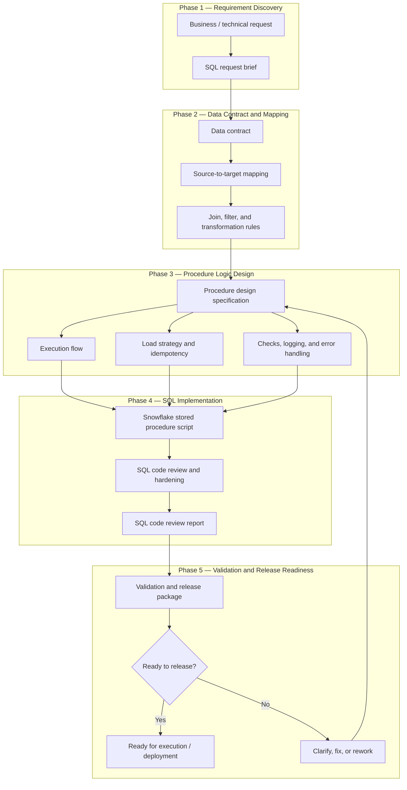

# Spec-Driven Workflow for Snowflake SQL Stored Procedure Creation - EN


## Project Overview

> [!NOTE]
> This project presents a **Generative AI-assisted, spec-driven workflow** for designing, generating, reviewing, and validating a Snowflake SQL stored procedure.

The workflow starts from a business or technical request and progressively transforms it into a structured SQL delivery package: request brief, data contract, source-to-target mapping, procedure logic design, Snowflake SQL script, code review report, validation plan, and release readiness checklist.

The main purpose of this project is to demonstrate how **Generative AI can support a senior-level SQL engineering workflow** while preserving technical control, traceability, data safety, and human validation.

This workflow is designed for complex Snowflake SQL scripts, especially stored procedures that may include:

- target table existence checks;
- conditional table creation;
- checks for existing data before insert or merge;
- source data extraction from multiple objects;
- complex joins and filters;
- transformation rules and business conditions;
- deduplication logic;
- insert, merge, or reload strategy;
- audit logging and execution status;
- validation before release.

Generative AI is used as an assistant to help the Data Engineer:

- structure unclear SQL requests;
- identify missing technical and data requirements;
- draft a source-to-target mapping;
- design stored procedure execution logic;
- generate a first Snowflake SQL script;
- review and harden SQL code;
- identify risks related to idempotency, duplicates, data loss, or performance;
- prepare validation and release readiness documentation.

> [!IMPORTANT]
> This workflow does not replace the Data Engineer. The engineer remains responsible for reviewing, correcting, testing, validating, and approving all AI-generated outputs before execution or deployment.

The goal of this project is to avoid premature SQL development, reduce rework, improve code quality, and show how Generative AI can be integrated into a structured analytics engineering and data engineering workflow.

---

## Engineering Workflow Phases

| Phase | Folder | Main purpose | Generative AI value | Data Engineer role |
|---|---|---|---|---|
| **Phase 1 - Requirement Discovery** | [`01_requirement_discovery`](./01_requirement_discovery/) | Captures the business or technical request and turns it into a structured SQL request brief. | Helps clarify the purpose, expected outcome, target object, execution context, load behavior, and open questions. | Challenges unclear needs, validates the request, identifies missing inputs, and confirms whether the need is ready for data mapping. |
| **Phase 2 - Data Contract & Mapping** | [`02_data_contract_and_mapping`](./02_data_contract_and_mapping/) | Defines source objects, target object, grain, fields, joins, filters, transformation rules, and source-to-target mapping. | Helps structure technical data requirements and identify missing fields, unclear joins, incomplete mapping, and data quality risks. | Validates source availability, confirms target structure, checks mapping logic, and ensures that no source or field is invented. |
| **Phase 3 - Procedure Logic Design** | [`03_procedure_logic_design`](./03_procedure_logic_design/) | Designs the stored procedure behavior before code generation, including parameters, DDL/DML strategy, checks, load mode, logging, errors, and idempotency. | Helps translate the data contract into a safe execution flow and highlight risks around existing data, duplicates, reload strategy, or failure handling. | Defines the final technical logic, validates execution safety, confirms load behavior, and ensures the procedure is unambiguous before SQL generation. |
| **Phase 4 - SQL Implementation** | [`04_sql_implementation`](./04_sql_implementation/) | Generates the Snowflake SQL stored procedure script and reviews it for correctness, safety, maintainability, and Snowflake compatibility. | Helps draft the SQL script, review syntax, detect unsafe DDL/DML logic, identify idempotency risks, and produce a structured code review report. | Reviews and corrects the SQL, validates Snowflake-specific behavior, checks performance and safety, and approves whether the script is ready for validation. |
| **Phase 5 - Validation & Release Readiness** | [`05_validation_and_release_readiness`](./05_validation_and_release_readiness/) | Prepares the SQL procedure for testing, execution, deployment, or handover through validation checks and release readiness documentation. | Helps create a validation plan, test scenarios, deployment checklist, rollback considerations, and final readiness assessment. | Runs or supervises tests, validates results, confirms access and execution context, assesses release readiness, and approves deployment or rework. |

The final output is a **validated, traceable, release-ready Snowflake SQL procedure package** that can be used to test, execute, deploy, or hand over the stored procedure with reduced ambiguity and stronger technical control.

---

## Engineering Workflow Diagram



---

## Repository Structure

The repository is organized as a five-phase workflow that follows the lifecycle of a Snowflake SQL stored procedure project — from the initial request to validation and release readiness.

Each phase contains a dedicated `README.md`, reusable **Generative AI prompt files**, and structured **artifact templates**. Prompt files are used to guide AI-assisted drafting, design, generation, review, or validation tasks. Artifact templates are the documents or scripts produced, completed, and validated by the Data Engineer before moving to the next phase.

The structure keeps the workflow modular, traceable, and reusable across different Snowflake SQL development scenarios.

```text
02_Spec_Driven_Workflow_for_Snowflake_SQL_Stored_Procedure/
│
├── 01_requirement_discovery/
│   ├── README.md
│   ├── 01_gen_ai_prompt_create_sql_request_brief.md
│   └── 02_sql_request_brief_template.md
│
├── 02_data_contract_and_mapping/
│   ├── README.md
│   ├── 01_gen_ai_prompt_create_data_contract_and_mapping.md
│   └── 02_data_contract_and_mapping_template.md
│
├── 03_procedure_logic_design/
│   ├── README.md
│   ├── 01_gen_ai_prompt_create_procedure_design_specification.md
│   └── 02_procedure_design_specification_template.md
│
├── 04_sql_implementation/
│   ├── README.md
│   ├── 01_gen_ai_prompt_generate_snowflake_sql_script.md
│   ├── 02_snowflake_stored_procedure_script.sql
│   ├── 03_gen_ai_prompt_review_and_harden_sql_script.md
│   └── 04_sql_code_review_report_template.md
│
├── 05_validation_and_release_readiness/
│   ├── README.md
│   ├── 01_gen_ai_prompt_create_validation_release_package.md
│   └── 02_validation_release_package_template.md
│
└── README.md
```

---

## How to Use This Workflow

1. Start with [`01_requirement_discovery`](./01_requirement_discovery/) to clarify the SQL request, expected outcome, target object, execution context, and open questions.
2. Move to [`02_data_contract_and_mapping`](./02_data_contract_and_mapping/) to define source objects, target table, grain, fields, joins, filters, transformation rules, and source-to-target mapping.
3. Use [`03_procedure_logic_design`](./03_procedure_logic_design/) to design the stored procedure behavior before generating SQL code.
4. Continue with [`04_sql_implementation`](./04_sql_implementation/) to generate the Snowflake SQL stored procedure script and review it for correctness, safety, maintainability, and Snowflake compatibility.
5. Complete [`05_validation_and_release_readiness`](./05_validation_and_release_readiness/) to validate the procedure, prepare test scenarios, assess risks, and confirm release readiness.
6. Review every AI-generated artifact manually before using it as a project deliverable or executing SQL in any environment.

Each phase contains reusable Markdown templates and Generative AI prompts that can be adapted to real Snowflake SQL development, analytics engineering tasks, data pipeline preparation, or portfolio case studies.

---

## Human-in-the-Loop Principle

This project follows a **human-in-the-loop engineering approach**.

Generative AI is used to accelerate clarification, specification, code drafting, review, and validation preparation. However, all outputs must be reviewed by a human Data Engineer before execution, testing, deployment, or handover.

The Data Engineer remains responsible for:

- validating the SQL request;
- confirming source and target objects;
- checking source-to-target mapping;
- validating joins, filters, transformations, and business rules;
- defining safe load behavior;
- preventing duplicates and unintended data loss;
- reviewing generated SQL code;
- testing Snowflake compatibility;
- checking performance and maintainability;
- confirming security, roles, grants, and execution context;
- approving the final release readiness decision.

> [!CAUTION]
> AI-generated SQL must never be executed without human review. Any table, field, join, filter, KPI, business rule, load strategy, security rule, or deployment assumption that is not explicitly confirmed must be marked as `To be confirmed`.

---

## Engineering Quality Principles

A Snowflake SQL stored procedure should move to implementation only when:

- the request is clear;
- the target result is defined;
- source objects are confirmed;
- target object behavior is documented;
- source-to-target mapping is complete;
- join and filter logic is explicit;
- load mode is confirmed;
- existing target data behavior is defined;
- idempotency risks are addressed;
- error handling and logging expectations are clear;
- security and execution context are understood;
- validation criteria are defined.

A Snowflake SQL stored procedure should move to release only when:

- the script compiles;
- procedure behavior matches the design specification;
- test scenarios have been executed or documented;
- row counts and business rules are validated;
- duplicate prevention has been checked;
- failure behavior is understood;
- performance risks are acceptable;
- deployment prerequisites are confirmed;
- rollback or recovery approach is documented.

---

## Final Deliverable

The final output of this workflow is a **release-ready Snowflake SQL stored procedure package** that includes:

- a validated SQL request brief;
- a data contract and source-to-target mapping;
- a stored procedure design specification;
- a Snowflake SQL stored procedure script;
- a SQL code review report;
- a validation and release readiness package.

The final package is designed to support safe execution, testing, deployment, or handover of a complex Snowflake SQL stored procedure.
